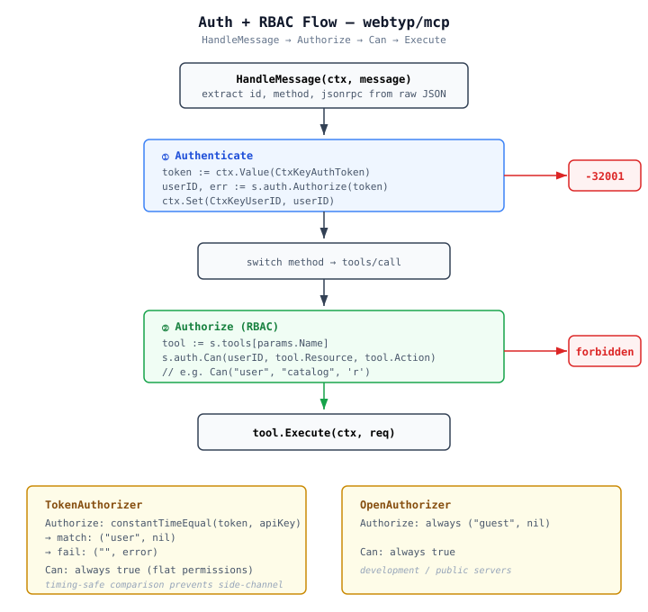

# Architecture: tinywasm/mcp

## Purpose

Lean Go implementation of MCP (Model Context Protocol) over JSON-RPC 2.0. Protocol-only, WASM-safe, no HTTP ownership. The consumer owns HTTP routing and injects optional SSE streaming.

## Design Principles

- **No HTTP ownership** — `mcp` never owns HTTP routing. Only exposes `HandleMessage()`.
- **Auth required** — `NewServer` returns error if `Config.Auth == nil`.
- **Mandatory RBAC** — Every tool call passes through `Authorizer.Can()` before execution.
- **SSE via DI** — Optional `SSEPublisher` injected by consumer for streaming notifications.
- **WASM-safe** — Protocol core compiles with TinyGo. Server-only files use `//go:build !wasm`.

## Architecture

```
Consumer (tinywasm/app)
    │
    ├─ owns HTTP routing
    ├─ creates Authorizer (token, open, or custom)
    ├─ optionally creates *sse.SSEServer → SSEPublisher
    │
    └─ NewServer(Config, []ToolProvider) → (*Server, error)
              │
              ▼
        ┌─────────────────────────────────────┐
        │  Server                             │
        │  HandleMessage(ctx, []byte) → msg   │
        │                                     │
        │  Auth flow:                         │
        │  1. Authorize(token) → userID       │
        │  2. Can(userID, resource, action)   │
        │                                     │
        │  SSE: Publish(data, channel)        │
        └─────────────────────────────────────┘
              │
              ▼
          MCP Client (LLM)
```

## Auth + RBAC Flow



```
HandleMessage(ctx, raw)
    │
    ├─ extract token from ctx (CtxKeyAuthToken)
    ├─ auth.Authorize(token) → userID, err
    │   └─ err? → -32001 Unauthorized
    ├─ ctx.Set(CtxKeyUserID, userID)
    │
    └─ tools/call:
        ├─ lookup tool by name
        ├─ auth.Can(userID, tool.Resource, tool.Action)
        │   └─ false? → -32001 Forbidden
        └─ tool.Execute(ctx, req)
```

## SSE Flow (Streamable HTTP)

```
Consumer creates *sse.SSEServer (satisfies SSEPublisher)
    │
    └─ Config.SSE = sseServer
          │
          ▼
    Server.AddTool(tool)
        └─ SSE.Publish(notifications/tools/list_changed, "mcp")

    Server.handleNotification(ctx, notification)
        └─ SSE.Publish(notification, "mcp")
```

SSE is optional — when `Config.SSE` is nil, no streaming occurs.

## Files

| File | Responsibility |
|------|---------------|
| `server.go` | `Server`, `Config`, `NewServer`, `HandleMessage` dispatch to handlers, `AddTool`, tool call/list/init/ping handlers |
| `request_handler.go` | `HandleMessage` JSON-RPC dispatch, `ExtractJSONValue`, `extractJSONString`, context keys |
| `mcp_auth.go` | `Authorizer` interface (`Authorize` + `Can`), `NewTokenAuthorizer`, `OpenAuthorizer` |
| `server_sse.go` | `SSEPublisher` interface (build `!wasm`) |
| `tools.go` | `Tool`, `Request`, `Request.Bind`, `Text`, `FilterFunc`, `ToolProvider` |
| `types.go` | JSON-RPC 2.0 types: `JSONRPCMessage`, `JSONRPCRequest`, `JSONRPCNotification`, `JSONRPCResponseStruct`, `JSONRPCError`, `Result`, error codes, MCP methods |
| `model.go` | ORM model definitions: `rpcRequest`, `rpcResponse`, `initializeParams`, `callToolParams`, etc. |
| `model_orm.go` | Generated ORM code: `Schema()`, `Pointers()`, `Validate()` for all models |
| `client.go` | `Client`: MCP client (`Call`, `Dispatch`) using `tinywasm/fetch` |
| `provider.go` | `Loggable` interface |
| `constants.go` | HTTP header constants, content type constants |
| `errors.go` | Error variables and `NewError` helper |
| `utils.go` | Result helpers: `JSON`, `GetText`, `ParseResult`, response builders |
| `logger.go` | `Logger` interface, `DefaultLogger` (stdlib wrapper) |

## Key Interfaces

```go
type Authorizer interface {
    Authorize(token string) (userID string, err error)
    Can(userID, resource string, action byte) bool
}

type SSEPublisher interface {  // build !wasm
    Publish(data []byte, channel string)
}

type ToolProvider interface {
    Tools() []Tool
}
```

## Constraints

- No global state
- No external HTTP dependencies in protocol core
- WASM build excludes `server_sse.go` via build tag
- All tools require `Resource` and `Action` fields (RBAC mandatory)
- `NewServer` rejects nil `Auth`
