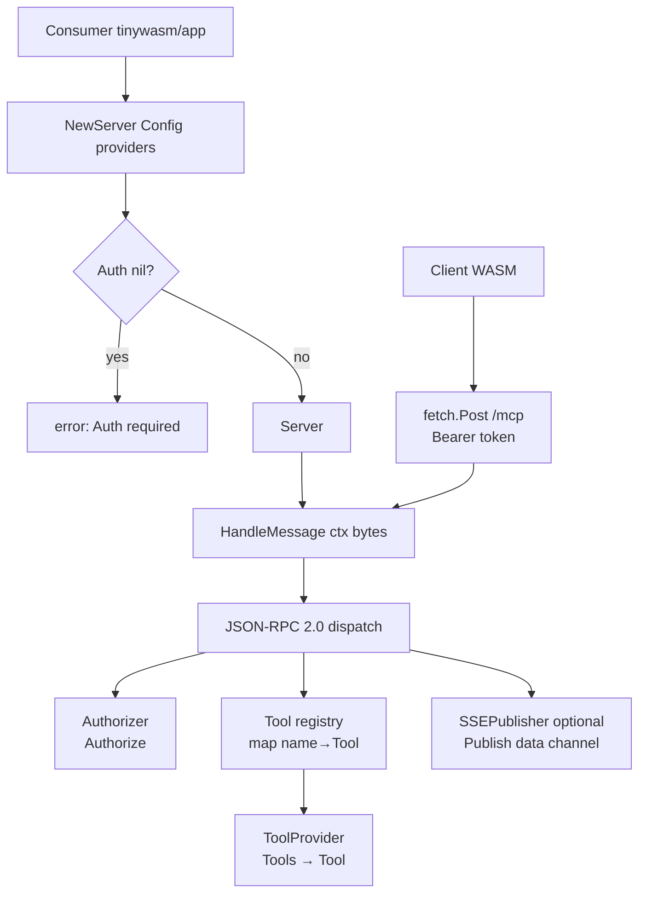

# Architecture Overview

```mermaid
flowchart TD
    A[Consumer tinywasm/app] --> B[NewServer Config providers]
    B --> C{Auth nil?}
    C -->|yes| D[error: Auth required]
    C -->|no| E[Server]
    E --> F[HandleMessage ctx bytes]
    F --> G[JSON-RPC 2.0 dispatch]
    G --> H[Authorizer<br/>Authorize]
    G --> I[Tool registry<br/>map name→Tool]
    G --> J[SSEPublisher optional<br/>Publish data channel]
    I --> K[ToolProvider<br/>Tools → Tool]
    L[Client WASM] --> M[fetch.Post /mcp<br/>Bearer token]
    M --> F
```
