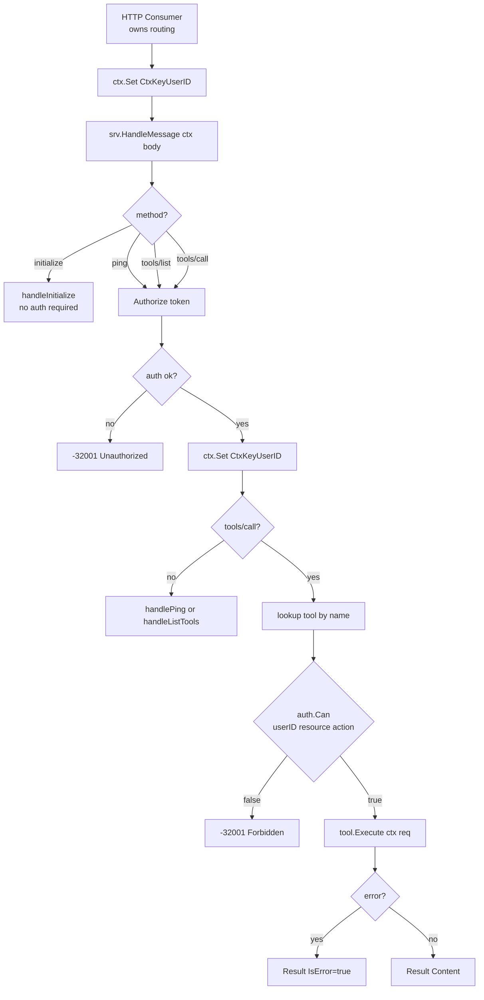

# Request Flow

```mermaid
flowchart TD
    A[HTTP Consumer<br/>owns routing] --> B[ctx.Set CtxKeyUserID]
    B --> C[srv.HandleMessage ctx body]
    C --> D{method?}
    D -->|initialize| E[handleInitialize<br/>no auth required]
    D -->|ping| F[Authorize token]
    D -->|tools/list| F
    D -->|tools/call| F
    F --> G{auth ok?}
    G -->|no| H[-32001 Unauthorized]
    G -->|yes| I[ctx.Set CtxKeyUserID]
    I --> J{tools/call?}
    J -->|no| K[handlePing or handleListTools]
    J -->|yes| L[lookup tool by name]
    L --> M{auth.Can<br/>userID resource action}
    M -->|false| N[-32001 Forbidden]
    M -->|true| O[tool.Execute ctx req]
    O --> P{error?}
    P -->|yes| Q[Result IsError=true]
    P -->|no| R[Result Content]
```
